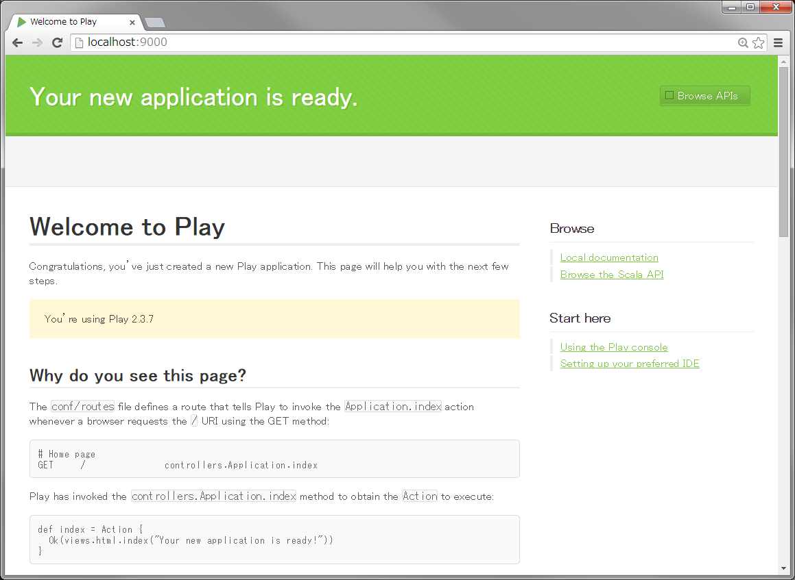

## Play本体のインストール

http://www.playframework.com/download からtypesafe-activator-1.3.2-minimal.zipをダウンロードし、解凍したディレクトリを環境変数PATHに追加します。

## 新規プロジェクト作成

コマンドプロンプトで以下のコマンドを実行します。途中でScalaアプリケーションとJavaアプリケーションのどちらを作成するかを聞かれるのでScalaアプリケーションを選択します。

```
activator new play2-hands-on
```


## Play2.3.x用に設定変更

2015/5/26 にPlay `2.4` がリリースされた為、↑のコマンドで作成されるPlayのバージョンも上がっています。このHandsOnでは、まだ `2.3.9` を利用するため、以下の設定を変更してください。また、あわせてORMにSlickを使うため、一緒に設定を変更します。

### `build.sbt`

```scala
name := "play2-hands-on"

version := "1.0-SNAPSHOT"

lazy val root = (project in file(".")).enablePlugins(PlayScala)

scalaVersion := "2.11.6"

libraryDependencies ++= Seq(
// jdbcからspec2〜まで消してください

//  jdbc,
//  anorm,
//  cache,
//  ws,
// specs2 % Test
  "com.typesafe.play" %% "play-slick" % "0.8.1" // <- この行を追加してください。
)

//routesGenerator := InjectedRoutesGenerator　// <- この行は消してください。
```

### `project/plugins.sbt`

```
// addSbtPlugin("com.typesafe.play" % "sbt-plugin" % "2.4.0") // <- この行を消して
addSbtPlugin("com.typesafe.play" % "sbt-plugin" % "2.3.9")  // <- この行を追加

```

### `app/controllers/Appliction.scala`

```
// class Application extends Controller {
object Application extends Controller {  // <- class から object に書き換えてください。

  def index = Action {
    Ok(views.html.index("Your new application is ready."))
  }

}
```


## 起動確認
作成した`play2-hands-on`ディレクトリに移動し、以下のコマンドでプロジェクトを実行します。

```
activator run
```

ブラウザから http://localhost:9000/ にアクセスし、以下の画面が表示されることを確認します。



`You’re using Play 2.3.9` が書かれていることを確認して下さい。

> **POINT**
> * `activator run`で実行している間はホットデプロイが有効になっているため、ソースを修正するとすぐに変更が反映されます
> * CTRL+Dで`activator run`での実行を終了することができます
> * `activator  run`で実行中に何度も修正を行っているとヒープが不足してプロセスが終了してしまったりエラーが出たまま応答がなくなってしまう場合があります
> * プロセスが終了してしまった場合は再度`activator run`を実行してください
> * 応答しなくなってしまった場合は一度コマンドプロンプトを閉じ、再度起動して`activator run`を実行してください

----
[＜ホームに戻る](README.md) | [IDEの準備へ進む＞](02_preparation_of_ide.md)
