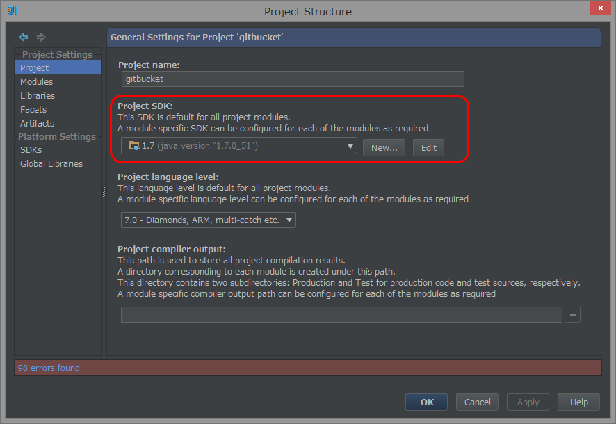

#　13.Tips

## Play2
* playコマンド実行時のVMオプションの設定
  * ヒープ設定やプロキシ設定などJVMの起動オプションを設定するには環境変数`JAVA_OPTS`を使用します
* Playが使用するローカルリポジトリ
  * 以前のバージョンのPlayは`PLAY_HOME/repository`ディレクトリ配下に独自のローカルリポジトリとキャッシュを持っていましたが、Play 2.3ではSBT標準の`HOME/.ivy2`ディレクトリ配下を使うようになりました
* Play公式サイトのドキュメントは http://www.playframework-ja.org/ で日本語訳されています

## Slick
* https://github.com/bizreach/slick-reference でSlickのリファレンスを公開しています

## ScalaIDE
* Scala IDEはEclipseのバージョン、Scalaのバージョンにあわせて更新サイトが用意されています
  * 最新情報は http://scala-ide.org/download/current.html を参照してください

## IntelliJ IDEA
* キーボードショートカット
  * (Windows) http://www.jetbrains.com/idea/docs/IntelliJIDEA_ReferenceCard.pdf
  * (Mac) http://www.jetbrains.com/idea/docs/IntelliJIDEA_ReferenceCard_Mac.pdf
* IDEAの外観を変更
  * スキンの変更（背景を黒に）
    * [Appearance]→[Theme]の箇所を"Default"から"Darcula"に変更
* IntelliJ上でクラスパスが解決できない場合
  * StringなどJavaの基本的な型が解決できずエラーになってしまう場合は実行した直後はJDKが選択されていない可能性があります
    * [File]→[Project Structure...]からインストール済みのJDKを選択してください

  * `build.sbt`を変更してもクラスパスが解決されないことがありますが、その場合は「File」→「Invalidate Caches / Restart...」でIntelliJのキャッシュをクリアしてみてください

----
[＜削除処理の実装に戻る](12_implement_delete_api.md)
