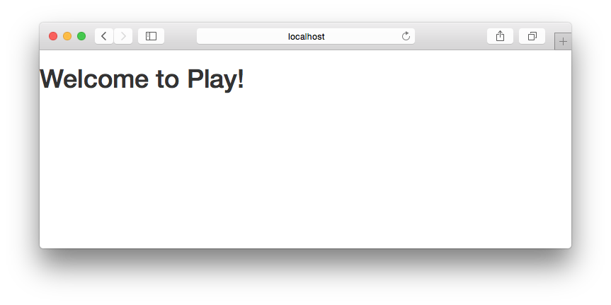

# 01.プロジェクトの作成

## sbtのインストール

まずはsbtをインストールします。sbtはScalaの標準的なビルドツールです。

**Windowsの場合**

以下のリンクからインストーラをダウンロードしてインストールします。

https://dl.bintray.com/sbt/native-packages/sbt/0.13.13.1/sbt-0.13.13.1.msi

**Macの場合**

Homebrewでインストールします。

```
brew update
brew install sbt
```

どちらの場合もインストール後以下のようにしてsbtコマンドが使えること、sbtのバージョンが0.13.13以降であることを確認してください。

```
sbt sbt-version
[info] Loading global plugins from /Users/naoki.takezoe/.sbt/0.13/plugins
[info] Set current project to naoki-takezoe (in build file:/Users/naoki.takezoe/)
[info] 0.13.13
```

## 新規プロジェクト作成

コマンドプロンプトで以下のコマンドを実行します。

```
sbt new playframework/play-scala-seed.g8
```

プロジェクト名などを聞かれますが、ここではプロジェクト名を`play2-hands-on`とし、他の項目は初期値のままプロジェクトを作成するものとします。


`play2-hands-on`ディレクトリの`build.sbt`にORMとしてSlickを使用するための設定を行います。

```scala
name := """play2-hands-on"""
organization := "com.example"

version := "1.0-SNAPSHOT"

lazy val root = (project in file(".")).enablePlugins(PlayScala)

scalaVersion := "2.11.8"

libraryDependencies += filters
libraryDependencies += "org.scalatestplus.play" %% "scalatestplus-play" % "1.5.1" % Test

// ↓↓↓↓ここから追加↓↓↓↓
libraryDependencies ++= Seq(
  "com.h2database" % "h2" % "1.4.193",
  "org.scalikejdbc" %% "scalikejdbc" % "2.5.1",
  "org.scalikejdbc" %% "scalikejdbc-config" % "2.5.1",
  "org.scalikejdbc" %% "scalikejdbc-play-initializer" % "2.5.1"
)
// ↑↑↑↑ここまで追加↑↑↑↑

// Adds additional packages into Twirl
//TwirlKeys.templateImports += "com.example.controllers._"

// Adds additional packages into conf/routes
// play.sbt.routes.RoutesKeys.routesImport += "com.example.binders._"
```

## 起動確認

作成した`play2-hands-on`ディレクトリに移動し、以下のコマンドでプロジェクトを実行します。

```
sbt run
```

ブラウザから http://localhost:9000/ にアクセスし、以下の画面が表示されることを確認します。



`Welcome to Play!` が書かれていることを確認して下さい。

> **POINT**
> * `sbt run`で実行している間はホットデプロイが有効になっているため、ソースを修正するとすぐに変更が反映されます
> * CTRL+Dで`sbt run`での実行を終了することができます
> * `sbt  run`で実行中に何度も修正を行っているとヒープが不足してプロセスが終了してしまったりエラーが出たまま応答がなくなってしまう場合があります
> * プロセスが終了してしまった場合は再度`sbt run`を実行してください
> * 応答しなくなってしまった場合は一度コマンドプロンプトを閉じ、再度起動して`sbt run`を実行してください

----
[＜ホームに戻る](README.md) | [IDEの準備へ進む＞](02_preparation_of_ide.md)
