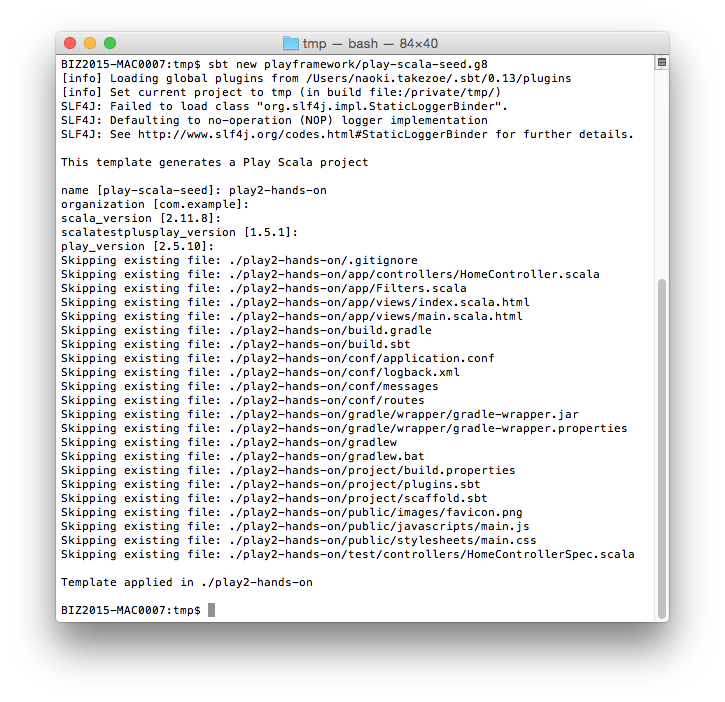

# 01.プロジェクトの作成

## Play本体のインストール

http://www.playframework.com/download からtypesafe-activator-1.3.10-minimal.zipをダウンロードし、解凍したディレクトリを環境変数PATHに追加します。

## 新規プロジェクト作成

コマンドプロンプトで以下のコマンドを実行します。途中でScalaアプリケーションとJavaアプリケーションのどちらを作成するかを聞かれるのでScalaアプリケーションを選択します。

```
activator new play2-hands-on
```



`play2-hands-on`ディレクトリの`build.sbt`にORMとしてSlickを使用するための設定を行います。

```scala
name := """play2-hands-on"""

version := "1.0-SNAPSHOT"

lazy val root = (project in file(".")).enablePlugins(PlayScala)

scalaVersion := "2.11.7"

libraryDependencies ++= Seq(
  jdbc,
  cache,
  ws,
  "org.scalatestplus.play" %% "scalatestplus-play" % "1.5.1" % Test,
  "com.h2database" % "h2" % "1.4.192",          // <- この行を追加してください
  "com.typesafe.play" %% "play-slick" % "2.0.0" // <- この行を追加してください
)

resolvers += "scalaz-bintray" at "http://dl.bintray.com/scalaz/releases"
```

## 起動確認

作成した`play2-hands-on`ディレクトリに移動し、以下のコマンドでプロジェクトを実行します。

```
activator run
```

ブラウザから http://localhost:9000/ にアクセスし、以下の画面が表示されることを確認します。


`You’re using Play 2.5.4` が書かれていることを確認して下さい。

> **POINT**
> * `activator run`で実行している間はホットデプロイが有効になっているため、ソースを修正するとすぐに変更が反映されます
> * CTRL+Dで`activator run`での実行を終了することができます
> * `activator  run`で実行中に何度も修正を行っているとヒープが不足してプロセスが終了してしまったりエラーが出たまま応答がなくなってしまう場合があります
> * プロセスが終了してしまった場合は再度`activator run`を実行してください
> * 応答しなくなってしまった場合は一度コマンドプロンプトを閉じ、再度起動して`activator run`を実行してください

----
[＜ホームに戻る](README.md) | [IDEの準備へ進む＞](02_preparation_of_ide.md)
