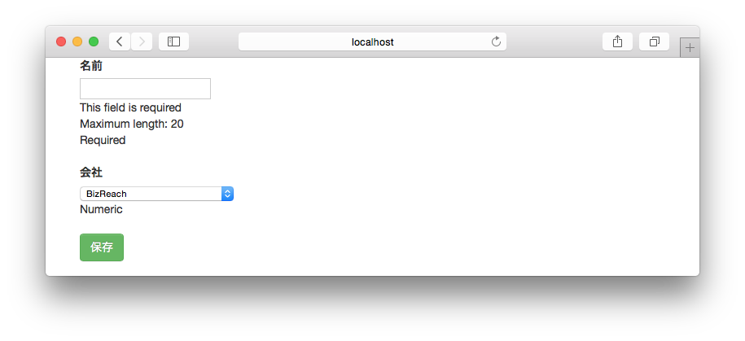

# 07.登録・更新処理の実装

入力値のバリデーションを行い、エラーの有無に応じて以下の処理を行います。

* エラーあり ⇒ フォームにエラー情報をセットして入力フォームに戻ります。
* エラーなし ⇒ DBへの登録・更新処理を行い、一覧画面へリダイレクトします。

## コントローラ

`UserController`のメソッドのうち、登録処理を行う`create`メソッドと更新処理を行う`update`メソッドを実装します。

入力フォームの値を受け取るには、`userForm.bindFromRequest`メソッドでリクエストの内容をFormにバインドし、`fold`メソッドでエラーがあった場合の処理と、OKの場合の処理を記述します。以下は`create`メソッドの実装例です。

```scala
def create = Action.async { implicit rs =>
  // リクエストの内容をバインド
  userForm.bindFromRequest.fold(
    // エラーの場合
    error => {
      db.run(Companies.sortBy(t => t.id).result).map { companies =>
        BadRequest(views.html.user.edit(error, companies))
      }
    },
    // OKの場合
    form  => {
      // ユーザを登録
      val user = UsersRow(0, form.name, form.companyId)
      db.run(Users += user).map { _ =>
        // 一覧画面へリダイレクト
        Redirect(routes.UserController.list)
      }
    }
  )
}
```

`update`メソッドも同じように実装します。

```scala
def update = Action.async { implicit rs =>
      // リクエストの内容をバインド
  userForm.bindFromRequest.fold(
    // エラーの場合は登録画面に戻す
    error => {
      db.run(Companies.sortBy(t => t.id).result).map { companies =>
        BadRequest(views.html.user.edit(error, companies))
      }
    },
    // OKの場合は登録を行い一覧画面にリダイレクトする
    form  => {
      // ユーザ情報を更新
      val user = UsersRow(form.id.get, form.name, form.companyId)
      db.run(Users.filter(t => t.id === user.id.bind).update(user)).map { _ =>
        // 一覧画面にリダイレクト
        Redirect(routes.UserController.list)
      }
    }
  )
}
```

上記のコードではそれぞれ以下の記述でユーザ情報の登録、更新を行う`DBIOAction`を生成しています。

```scala
Users += user

Users.filter(t => t.id === user.id.bind).update(user)
```

これはそれぞれ以下のSQLに該当します。

```sql
INSERT INTO USERS (ID, NAME, COMPANY_ID) VALUES (?, ?, ?)

UPDATE USERS SET NAME = ?, COMPANY_ID = ? WHERE ID = ?
```

登録時は`UsersRow`のIDカラムに対応するプロパティに0を指定していますが、自動採番のカラムの場合、Slickはプロパティにセットされた値を無視して自動採番された値でインサートします（なので実はインサート時は0以外の値をセットしても構いません）。

ここでは1つのSQLを実行しているだけですが、複数のSQLを実行するには以下のように`for`式を使って合成した`DBIOAction`を作成します。また、`DBIOAction`に対して`transactionally`メソッドを呼び出すことでその`DBIOAction`をトランザクションで処理できるようになります。

```scala
// 合成したDBIOActionを生成
val action = (for {
  ns <- Users.filter(_.name === name.bind).map(_.id).result
  _ <- DBIO.seq(ns.map(id => Users.filter(_.id === id.bind).delete): _*)
} yield ()).transactionally

// 合成したDBIOActionを実行
val f: Future[Unit] = db.run(action)
```

> **POINT**
> * HTMLテンプレートでのリンク先と同様、リダイレクト先も`routes.・・・`でタイプセーフに指定することができます
> * 複数のSQLを実行する場合は`for`式で`DBIOAction`を合成します
> * `DBIOAction`に対して`transactionally`メソッドを呼び出すことでその`DBIOAction`をトランザクションで処理できます

## 実行

ここまで実装したら、登録画面や編集画面からユーザ情報の登録、編集を行えることを確認しましょう。ユーザ名を空欄や20文字以上で登録しようとするとエラーメッセージが表示され、バリデーションが働いていることも確認できるはずです。

**バリデーションエラー時の表示：**


----
[＜ユーザ登録・編集画面の実装に戻る](06_implement_user_form.md) | [削除処理の実装に進む＞](08_implement_delete_processing.md)
